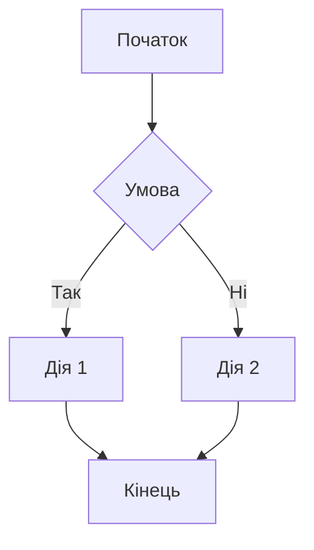
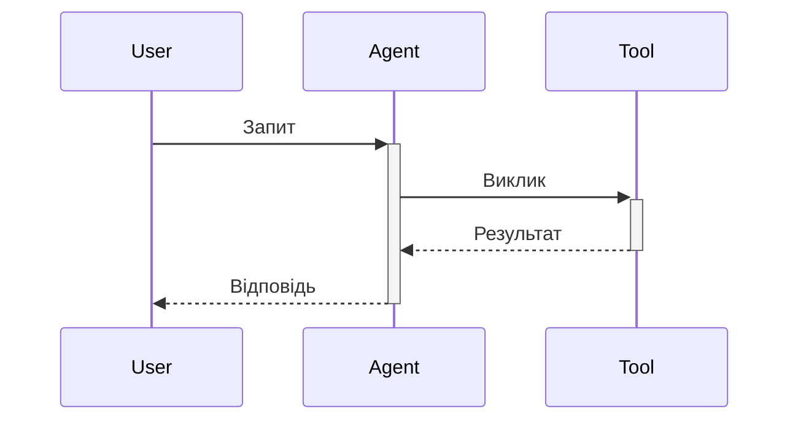
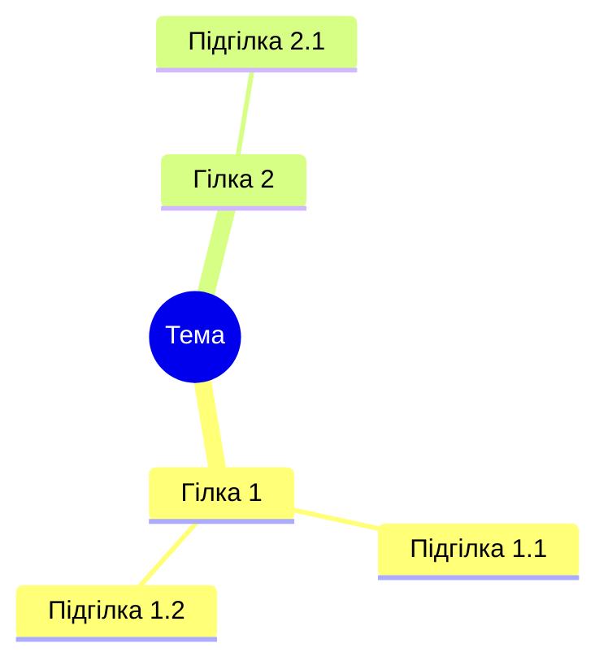
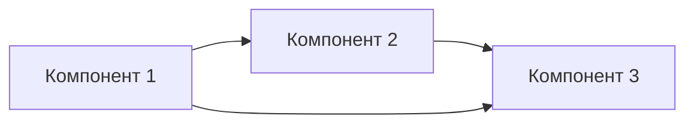

Створи **$1** діаграму в Mermaid синтаксисі.

## Типи діаграм

### flowchart - Блок-схема процесу

### sequence - Діаграма послідовності

### mindmap - Карта думок

### graph - Архітектура

## Правила

1. Додай `{scale: 0.8}` якщо діаграма велика
2. Використовуй українські підписи де можливо
3. Тримай діаграму простою (5-10 елементів)
