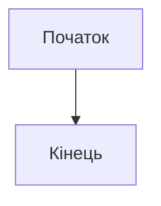
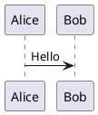

---
paths:
  - "slidev/**/*.md"
  - "slidev/**/*.vue"
---

# Правила синтаксису Slidev

## Розділювачі слайдів

- Використовуй `---` на окремому рядку для розділення слайдів
- Перший слайд починається після frontmatter блоку

## Frontmatter конфігурація

```yaml
---
theme: seriph              # Тема (за замовчуванням для проєкту)
layout: two-cols           # Layout слайда
transition: slide-left     # Анімація переходу
class: text-center         # CSS класи
---
```

### Доступні layouts
- `default` - Стандартний layout
- `two-cols` - Дві колонки (використовуй `::right::` для розділення)
- `image-right` - Зображення справа
- `center` - Центрований контент
- `cover` - Титульний слайд
- `section` - Секційний роздільник

### Доступні transitions
- `slide-left` / `slide-right`
- `fade-out` / `fade`
- `slide-up` / `slide-down`

## Анімації

### v-click - Поява по кліку
```html
<div v-click>Цей текст з'явиться по кліку</div>

<v-click>
  Альтернативний синтаксис
</v-click>
```

### v-mark - Виділення тексту
```html
<span v-mark.red="1">Виділений текст</span>
<span v-mark.circle.orange="2">Обведений текст</span>
<span v-mark.underline="3">Підкреслений текст</span>
```

### v-motion - Анімації руху
```html
<div
  v-motion
  :initial="{ x: -80 }"
  :enter="{ x: 0 }"
  :click-3="{ x: 80 }"
>
  Анімований елемент
</div>
```

### v-drag - Перетягування
```html
<v-drag pos="100,100,200,_">
  Перетягуваний елемент
</v-drag>
```

## Блоки коду

### Базовий синтаксис
```markdown
```ts {1|2-3|all}
const x = 1      // Підсвічується на крок 1
const y = 2      // Підсвічується на крок 2
const z = 3      // Підсвічується на крок 2
```
```

### Monaco Editor (інтерактивний)
```markdown
```ts {monaco}
// Редагований код
const greeting = "Hello"
```
```

### Monaco Run (виконуваний)
```markdown
```ts {monaco-run}
console.log("Це виконається!")
```
```

### Зовнішні сніпети
```markdown
<<< @/snippets/example.ts#regionName
```

## Діаграми

### Mermaid
```markdown

```

### PlantUML
```markdown

```

## Vue компоненти

Компоненти з `slidev/components/` автоматично доступні:

```html
<Counter :count="10" />
<Tweet id="1234567890" />
<Youtube id="dQw4w9WgXcQ" />
```

## Presenter notes

Додавай нотатки для presenter mode в HTML коментарях наприкінці слайда:

```markdown
---

# Заголовок слайда

Контент слайда...

<!--
Ці нотатки видно тільки в presenter mode.
Підтримується **Markdown** форматування.
-->
```
